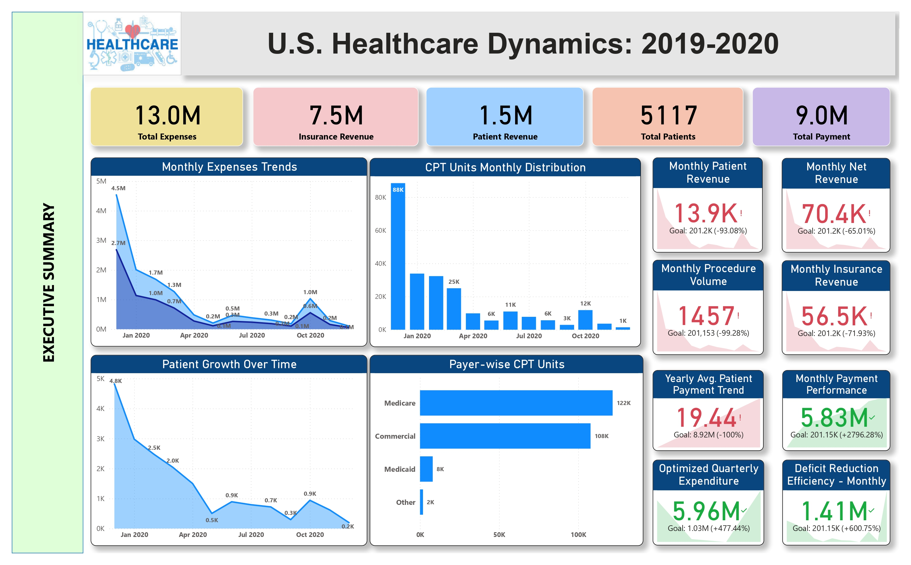
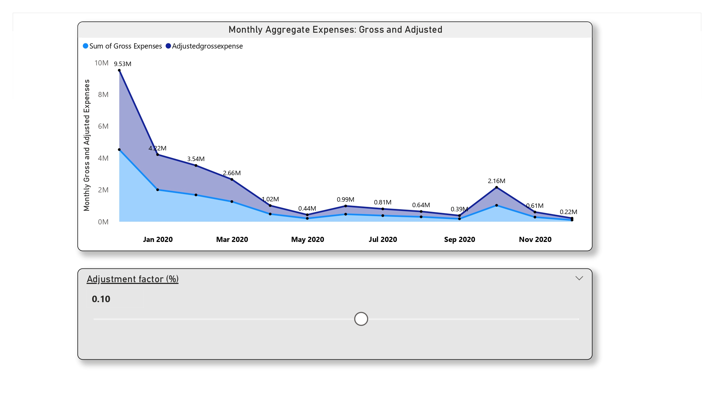
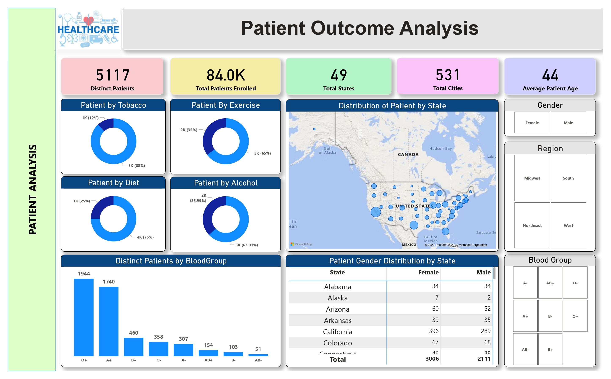

# 🏥 U.S. Healthcare Dynamics: 2019–2020

## 📌 Project Overview
This project analyzes **U.S. healthcare performance (2019–2020)** through KPIs and dashboards. It evaluates expenses, revenue, patient growth, procedure volumes, and payer distribution. The goal is to track **financial health and operational efficiency** with clear visualizations.

---

## 🗂️ Project Features
- **Key KPIs**
  - Total Expenses, Revenue, Patients, Payments  
- **Trends**
  - Monthly Expenses & Patient Growth  
- **Operational Metrics**
  - CPT Units, Procedure Volumes  
- **Financial Insights**
  - Insurance vs. Patient Revenue, Net Revenue  
- **Performance**
  - Quarterly Expenditure Optimization, Deficit Reduction  

---

## ⚙️ Tools & Technologies
- **Power BI** (for data visualization)  
- KPI cards, charts, and dashboards  

---

## 🚀 How to Use
1. Open the dashboard file in **Power BI**.  
2. Explore KPIs, trends, and metrics.  
3. Use visuals to derive insights into healthcare performance.  

---

## 📊 Dashboard Snapshots
Below are 5 key visuals from the dashboard:

### 1️⃣ Executive Summary

### 2️⃣ Healthcare Provider Metrics

### 3️⃣ Hospital Insights

### 4️⃣ Monthly Expensesre Trends

### 5️⃣ Patient Outcome Analysis

---

## 📊 Key Insights
- Expenses and patient volumes declined sharply post early 2020.  
- Insurance revenue dominates compared to patient revenue.  
- Medicare and Commercial are the largest contributors in CPT units.  
- Operational KPIs show **positive efficiency in expenditure and deficit reduction**.  

---

## 📝 Author
Developed by **Suyash Shewale**  
Healthcare analytics project with KPI dashboards and insights.

